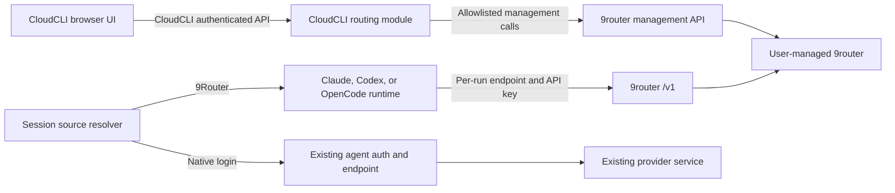

# 9Router API-Only Integration Design

**Status:** Approved
**Date:** 2026-08-04
**Scope:** CloudCLI Settings UI, backend adapter, and per-run coding-agent configuration

## Summary

CloudCLI will connect to a user-managed 9router instance through its management and OpenAI-compatible APIs. CloudCLI will not bundle, start, stop, supervise, migrate, or patch the 9router process.

The product adds exactly one user-facing surface: **Settings > 9Router**. It is a single scrollable settings page with no nested routes or internal tabs. Connection management, routing defaults, upstream account management, route editing, and compact usage information use sections that expand inline. API adaptation, authentication, compatibility handling, runtime injection, retries, caching, and security controls remain internal.

Claude, Codex, OpenCode, and Cursor continue to be visible coding-agent runtimes. 9router is an optional model source below those runtimes, not a fifth `LLMProvider`. Each agent keeps its existing native login path. A supported agent may instead use 9router for a selected run without overwriting or migrating its native credentials.

This follows the useful part of AionUI's model: agent identity and agent-owned authentication remain stable while gateway-backed model configuration is additive. CloudCLI will not copy AionUI code or its local-only security assumptions.

## Goals

- Connect CloudCLI to an existing local or remote 9router instance.
- Configure supported 9router accounts and ordered fallback routes through a native CloudCLI settings page.
- Route Claude, Codex, and OpenCode sessions directly to the selected 9router `/v1` endpoint.
- Keep existing native login, subscription, API-key, and provider behavior available and unchanged by default.
- Let supported agents choose `Native login` or `9Router` as their model source without changing agent identity.
- Protect management credentials, data-plane keys, outbound network access, logs, and session metadata.
- Detect upstream versions and capabilities instead of assuming every 9router installation has the same API.
- Fit the current Settings interaction and visual system.

## Non-goals

- Bundling or supervising a 9router process.
- Copying or embedding the 9router dashboard.
- Adding 9router to the closed `LLMProvider` union.
- Replacing, reading, migrating, or rewriting a coding agent's native OAuth or credential files.
- Proxying model traffic through a new CloudCLI gateway.
- Reimplementing account rotation, cooldown, provider format conversion, or fallback selection.
- Importing or modifying the 9router database directly.
- Promising hard per-policy budget enforcement. Current management APIs expose usage data but not a hard budget policy contract.
- Enabling Cursor routing before its custom endpoint behavior is verified.

## Reference model: AionUI

AionUI was reviewed as a product and architecture reference at repository commit `322ecfd`, together with its public LLM Configuration and ACP Setup documentation.

The relevant lessons are:

- Coding agents remain distinct runtimes.
- Each external CLI owns its native authentication and configuration.
- Gateway providers are optional additions, not replacements for the agents.
- Endpoint, key, and protocol are validated before models are offered.
- Per-agent environment overrides can change API key or base URL, while OAuth remains CLI-owned.

AionUI's public implementation does not directly provide the exact CloudCLI behavior. Its configured NewAPI gateway primarily powers its built-in agent, while external CLI agents keep their own models and authentication. CloudCLI intentionally extends the separation model by supplying a verified 9router configuration to supported Claude, Codex, and OpenCode instances at run time.

CloudCLI also has a browser/server and potentially hosted topology. It therefore requires a stronger outbound-network and secret boundary than a local desktop configuration store.

## Product boundary



The browser never calls 9router directly. This avoids exposing management credentials, depending on upstream CORS behavior, and turning the browser into the security boundary.

Model traffic does not pass through the CloudCLI routing module. Supported runtimes receive the 9router endpoint and data-plane API key when their child process or SDK instance is created.

## User experience

### Settings navigation

Add one `9Router` entry to the existing Settings navigation. No provider replacement, nested page, dashboard shell, or five-tab navigation is introduced.

```text
Settings
├─ General
├─ Appearance
├─ Agents
├─ Credentials
├─ MCP
├─ Skills
└─ 9Router
```

### First-run state

The page initially contains one focused connection card:

```text
┌──────────────────────────────────────────────────────────┐
│ Connect 9Router                                          │
│ Use an existing local or remote 9router instance.        │
│                                                          │
│ Endpoint        [ http://127.0.0.1:20128             ]  │
│ Admin password  [ ••••••••••••••                    ]  │
│ API key         [ sk-••••••••••••                   ]  │
│                                                          │
│ Remote connections must use HTTPS.                       │
│                                [Test and connect]         │
└──────────────────────────────────────────────────────────┘
```

`Test and connect` validates the target policy, health endpoint, management authentication, version profile, model listing, and data-plane API key before storing the connection. Failed credentials are not persisted.

### Connected state

After connection, the form collapses into a compact status header. The rest of the page becomes available below it.

```text
┌──────────────────────────────────────────────────────────┐
│ 9Router                                      ● Connected │
│ http://127.0.0.1:20128 · v0.5.45        [Test] [•••]    │
└──────────────────────────────────────────────────────────┘

DEFAULT ROUTING
┌──────────────────────────────────────────────────────────┐
│ Claude      [Native login | 9Router] [Quality first ▾]   │
├──────────────────────────────────────────────────────────┤
│ Codex       [Native login | 9Router] [Quality first ▾]   │
├──────────────────────────────────────────────────────────┤
│ OpenCode    [Native login | 9Router] [— ▾]               │
├──────────────────────────────────────────────────────────┤
│ Cursor      Native login only                 ◐ Verify   │
└──────────────────────────────────────────────────────────┘

UPSTREAMS & ROUTES
┌──────────────────────────────────────────────────────────┐
│ 6 accounts · 3 routes · 1 account cooling down          │
│                                            [Manage ▾]    │
└──────────────────────────────────────────────────────────┘

USAGE
┌──────────────────────────────────────────────────────────┐
│ Today   128 requests   4.2M tokens   $3.84 estimated     │
│ Daily alert at $5.00                         [Change ▾]   │
└──────────────────────────────────────────────────────────┘
```

All management controls expand inside this page. They do not navigate to a second product surface.

### Connection section

The collapsed header shows:

- Connection state.
- Normalized endpoint origin.
- Detected version.
- Last successful check.
- Test action.
- Overflow actions for editing credentials and disconnecting.

Changing the endpoint or credentials reruns the full validation sequence. The UI never reads a saved secret back from the server. Existing secrets appear only as `Configured` indicators and may be replaced or cleared.

### Default routing section

Each coding-agent row selects a **model source** without changing the agent itself:

- `Native login` preserves that agent's existing OAuth, subscription, API key, endpoint, model behavior, and credential files.
- `9Router` uses a compatible route selected by stable upstream route ID and injects the required settings into that runtime instance only.
- Selecting or disconnecting 9router never logs the user out of the native agent.

Provider defaults apply to new sessions. A session stores the resolved model source and route ID when it starts so later default changes do not silently alter an active session. A future per-session override may reuse the existing new-session controls, but it does not introduce another settings page.

Initial capability policy:

| Runtime | Initial state | Injection mechanism |
| --- | --- | --- |
| Claude | Supported | Per-run `ANTHROPIC_BASE_URL` and authentication environment |
| Codex | Supported | Per-instance SDK `baseUrl`, `apiKey`, and environment |
| OpenCode | Supported | Per-process `OPENCODE_CONFIG_CONTENT` provider configuration |
| Cursor | Disabled | Custom endpoint behavior must be verified first |

### Upstreams and routes section

The collapsed section shows counts and health summaries only. Expanding it reveals compact native controls.

Accounts are grouped by upstream provider and show:

- Display name and authentication class.
- Active state and priority.
- Quota or reset information when the upstream API supplies it.
- Healthy, cooling down, limited, or failed state.
- Test, edit, disable, and confirmed removal actions.

Routes are ordered fallback chains and show:

- Stable route name and ID.
- Ordered model targets.
- Provider, billing class, and current health for each target when available.
- Which coding-agent defaults use the route.
- Test, rename, edit order, and confirmed removal actions.

The editor uses searchable model selection and accessible move-up and move-down controls. It prevents duplicate targets. A drag handle can be added later without changing the contract.

OAuth account authorization may open the upstream authorization flow in a separate browser surface when supported by the detected capability profile. The user returns to the same Settings page after completion.

### Usage section

The page shows a small operational summary instead of a dashboard:

- Period selection for today, 7 days, and 30 days.
- Request, token, and estimated cost totals when reported.
- Compact provider or model distribution bars.
- Recent route or upstream failures without prompt or response content.
- Optional daily and monthly warning thresholds.

Warnings are advisory notifications. They are not labeled or implemented as request blocking because current 9router APIs do not expose a hard budget policy.

### Responsive behavior

- Desktop remains a single primary column within the existing `md:max-w-4xl` Settings modal.
- Mobile uses the existing horizontally scrollable top-level Settings navigation and full-width cards.
- Inline expansions remain in document flow and do not introduce nested scroll containers.
- Important actions remain reachable by keyboard and have visible focus states.

### UI states

The page explicitly handles:

- Initial loading.
- Not configured.
- Connected.
- Degraded with a last-known status snapshot.
- Offline.
- Unauthorized.
- Unsupported or partially supported version.
- Invalid data-plane key.
- Mutation in progress.
- Field validation and upstream operation errors.

Mutations are pessimistic. The submit action is disabled during the request, field or operation errors appear inline, and the canonical state is fetched after success. Destructive actions require confirmation.

## Backend architecture

Backend implementation lives in a dedicated `server/modules/routing/` feature module and follows the repository's backend module standards.

### Responsibilities

`RoutingService` coordinates the feature:

- Loads the user-scoped connection.
- Resolves and validates stored secrets through `RoutingSecretStore`.
- Calls `NineRouterClient` for typed upstream operations.
- Produces the aggregate settings view model.
- Stores CloudCLI-specific runtime defaults, session overrides, and advisory alerts.
- Supplies per-run routing configuration to existing runtime launchers.

`NineRouterClient` is the only outbound management adapter:

- Normalizes and validates the configured target.
- Establishes and refreshes the management cookie session.
- Calls only allowlisted 9router operations.
- Applies strict timeouts, response-size limits, and schema validation.
- Maps version-specific payloads into stable CloudCLI DTOs.
- Redacts upstream errors before returning them.

`RoutingRepository` owns CloudCLI routing tables only. It does not access the 9router database.

`RoutingSecretStore` is a platform abstraction:

- Desktop uses the operating-system-backed Electron `safeStorage` path.
- Headless and hosted deployments use envelope encryption with a required deployment secret.
- Secrets are never stored as plaintext database columns.
- A deployment without a secure secret-store configuration fails closed for persistent connection setup.

Routes remain thin HTTP transport adapters. Runtime launchers depend on a narrow routing configuration interface rather than importing HTTP or repository code.

### CloudCLI API

The browser uses an aggregate read model for the single settings page:

- `GET /api/routing`
  - Returns connection status, capability flags, default bindings, account and route summaries, usage summary, and alert configuration.
  - Returns secret presence booleans only.
  - Supports optional detail expansion so large account, route, or usage payloads are fetched only when their section opens.

Typed mutation endpoints remain internal product APIs:

- `PUT /api/routing/connection`
- `DELETE /api/routing/connection`
- `POST /api/routing/connection/validations`
- Account create, update, test, authorization, and delete operations under `/api/routing/accounts`
- Route create, update, test, reorder, and delete operations under `/api/routing/routes`
- Provider default and session override operations under `/api/routing/bindings`
- Advisory threshold operations under `/api/routing/usage-alerts`

These endpoints expose CloudCLI DTOs, not raw upstream JSON. The backend is not a generic path proxy.

### Connection DTO

A connection read returns safe metadata only:

```ts
interface RoutingConnectionView {
  configured: boolean;
  baseUrl: string | null;
  status: 'disconnected' | 'checking' | 'connected' | 'degraded' | 'offline';
  version: string | null;
  hasAdminCredential: boolean;
  hasApiKey: boolean;
  lastCheckedAt: string | null;
  lastError: RoutingSafeError | null;
  capabilities: RoutingCapabilities;
}
```

A write accepts optional replacement secrets:

```ts
interface UpdateRoutingConnectionInput {
  baseUrl: string;
  adminPassword?: string;
  apiKey?: string;
  clearAdminPassword?: boolean;
  clearApiKey?: boolean;
}
```

The response never echoes either secret.

### Data model

CloudCLI stores only connection metadata and CloudCLI-owned behavior.

`routing_connections`

- User ID with a unique constraint.
- Normalized base URL.
- Admin secret reference.
- Data-plane key secret reference.
- Secret format version.
- Last detected upstream version and capability profile.
- Last successful check timestamp.
- Created and updated timestamps.

`routing_bindings`

- User ID.
- Coding-agent provider.
- Scope: provider default or session.
- Optional owned session ID.
- Mode: native login or 9router.
- Stable upstream route ID and cached display name.
- Created and updated timestamps.

`routing_usage_alerts`

- User ID.
- Period.
- Threshold stored in integer minor units.
- Enabled state.
- Last notification period to prevent duplicate alerts.
- Created and updated timestamps.

Accounts, models, routes, quotas, cooldowns, and usage facts remain authoritative in 9router. CloudCLI may keep a short-lived status cache for resilience but does not create a second source of truth.

### Runtime resolution

At session creation:

1. Verify session ownership.
2. Resolve a session override, otherwise the provider default.
3. If the model source is native login, preserve the existing runtime configuration exactly and do not inject router variables.
4. If the mode is 9router, require a healthy connection and supported runtime capability.
5. Load the data-plane key from the secret store.
6. Inject the normalized `/v1` endpoint, key, and selected route or model into that runtime instance only.
7. Persist safe routing metadata such as mode and route ID, never the key.

A routing failure before process launch produces a typed user-facing error with a native-login recovery action. CloudCLI does not silently change a routed session to native login because that could change cost, privacy, authentication, and model selection.

## Version and capability handling

9router's management API is an integration boundary, not a CloudCLI-owned stable API. The adapter therefore uses explicit capability profiles.

Connection validation records:

- Product identity when available.
- Semantic version when available.
- Management authentication support.
- Account listing and mutation support.
- Route listing and mutation support.
- Usage support.
- Model listing and data-plane authentication support.

Known tested versions receive a pinned profile and contract tests. A newer or unknown version may connect in read-only or reduced-capability mode when safe probes succeed. Unsupported mutations remain disabled with an explanation. CloudCLI does not guess unknown write payloads.

## Security design

### Credential handling

- The admin password and data-plane API key are write-only.
- Browser responses contain presence booleans, never secret values or reversible masked strings.
- Secrets are encrypted through `RoutingSecretStore` before persistence.
- The management cookie jar remains server-side and in memory. It is refreshed from the stored admin secret when required.
- Authorization headers, cookies, submitted secrets, and upstream payload fragments are removed from logs and error responses.
- Runtime keys are injected only into the selected child process or SDK instance.
- Session records, analytics, crash reports, and command previews exclude runtime keys.
- Secret replacement and connection deletion produce security audit events without secret material.

### SSRF and outbound policy

A user-configured URL is treated as untrusted input.

- Accept only `http` and `https` schemes.
- Reject embedded credentials, fragments, unexpected ports when deployment policy restricts them, and non-normalizable hostnames.
- Require HTTPS for non-loopback remote targets.
- Hosted mode blocks loopback, private, link-local, multicast, carrier-grade NAT, documentation, and cloud metadata address ranges for IPv4 and IPv6.
- Desktop may allow loopback HTTP because 9router is user-managed on the same machine.
- Self-hosted deployments may opt into explicit host or CIDR allowlists. Private-network access is never enabled by an unscoped boolean in hosted mode.
- Resolve all A and AAAA records, validate every result, pin the validated destination for the request, and revalidate on later requests.
- Disable redirects so a validated public URL cannot redirect to a private target.
- Apply strict connect, headers, body, and total request timeouts.
- Apply response-size limits before parsing.

### No arbitrary proxy

The routing module exposes typed CloudCLI operations only. It does not accept an arbitrary upstream path, HTTP method, request body, or target URL from the browser.

Every outbound operation maps to an allowlisted 9router capability and schema. This prevents the authenticated endpoint from becoming a general network pivot.

### Request protection

- All routing endpoints require the existing authenticated user session.
- Repository operations are scoped to the authenticated user.
- Session overrides verify that the user owns the target session.
- State-changing requests use the application's same-origin and CSRF protections.
- Connection tests, authorization starts, account mutations, and route mutations are rate-limited per user and target.
- OAuth callback state is random, single-use, short-lived, bound to the user and target, and never accepted from an unvalidated origin.

### Response validation and safe errors

All upstream responses are runtime-schema validated. Invalid or oversized responses become typed errors and are not passed through to the browser.

Stable error codes include:

- `ROUTING_TARGET_BLOCKED`
- `ROUTING_UNREACHABLE`
- `ROUTING_AUTH_FAILED`
- `ROUTING_API_KEY_REJECTED`
- `ROUTING_UNSUPPORTED_VERSION`
- `ROUTING_CAPABILITY_UNAVAILABLE`
- `ROUTING_UPSTREAM_RESPONSE_INVALID`
- `ROUTING_OPERATION_FAILED`

Safe messages may include the normalized origin, operation name, status class, and retry guidance. They must not include query strings, credentials, cookies, authorization headers, raw upstream bodies, or stack traces.

## Error handling and resilience

- Safe read requests may use bounded retries with jitter for transient connection errors.
- Writes are not automatically retried unless the operation is proven idempotent.
- A short-lived cache may keep the last successful status, account summary, route summary, and usage summary.
- Stale data is labeled with its timestamp and never presented as live.
- Mutations are disabled while the connection is offline, unauthorized, or on an unsupported write profile.
- No offline mutation queue is created.
- Disconnect removes CloudCLI credentials and bindings after confirmation. It does not alter or shut down 9router.

## Testing strategy

### Unit tests

- URL normalization and scheme restrictions.
- IPv4 and IPv6 special-range detection, including alternate representations.
- Redirect rejection and DNS result validation.
- Secret redaction in logs and safe errors.
- Capability profile selection.
- Runtime binding precedence and ownership checks.
- Native-login preservation and model-source precedence.
- Threshold integer-unit calculations.

### Adapter contract tests

Use a controlled fake 9router HTTP server to verify:

- Management login and cookie refresh.
- Health, version, model, account, route, and usage mappings.
- Timeout, oversized body, malformed JSON, and schema mismatch handling.
- Authentication failure redaction.
- Known version profiles.
- Unknown version read-only degradation.

Tests must not require a developer's real 9router credentials or installation.

### Integration tests

- Connection setup writes encrypted secrets and returns presence booleans.
- Another user cannot read or mutate the connection, bindings, or alerts.
- Account and route writes call only allowlisted adapter operations.
- Claude, Codex, and OpenCode receive the expected endpoint and key for one runtime instance.
- Secrets are absent from stored session metadata and captured logs.
- Disconnect does not send lifecycle commands to 9router.

### UI tests

- Exactly one Settings navigation item and one 9Router page exist.
- First-run validation, connected collapse, inline expansion, and disconnect flows work.
- Secret inputs are cleared after submission and cannot be read back.
- Unsupported Cursor and unsupported upstream capabilities are visibly disabled.
- Loading, degraded, offline, unauthorized, and incompatible-version states render correctly.
- Keyboard navigation, focus management, confirmation dialogs, and mobile layout are usable.

## Rollout

- The feature is unconfigured and inert by default.
- Existing provider settings and sessions require no migration.
- Native login remains the default for every coding-agent provider.
- Introduce the connection and read-only status path first.
- Enable account and route mutations only for contract-tested capability profiles.
- Enable Claude, Codex, and OpenCode routing independently after runtime integration tests pass.
- Keep Cursor disabled until a verified endpoint configuration and regression suite exist.
- Document the tested 9router version range and the distinction between usage alerts and hard budgets.

## Alternatives rejected

### Bundled or supervised sidecar

Rejected because it adds process lifecycle, installation, upgrade, port, database, migration, and platform packaging responsibilities that the user does not want CloudCLI to own.

### Native CloudCLI model gateway

Rejected because it duplicates 9router's routing, account rotation, format conversion, health, and quota behavior. It also creates a new model-traffic security boundary.

### Browser-to-9router calls

Rejected because it exposes management credentials, depends on CORS, weakens network policy enforcement, and cannot safely normalize version-specific payloads.

### Multiple settings pages or internal tabs

Rejected because this is one optional integration. A single progressively disclosed Settings page matches the product scope and existing modal width.

## Acceptance criteria

- CloudCLI shows one and only one new `Settings > 9Router` page.
- CloudCLI never starts, stops, upgrades, or directly accesses 9router storage.
- Browser code never receives 9router admin credentials or data-plane keys.
- Secrets are encrypted at rest through a platform secret store and are read as presence flags only.
- Outbound management calls enforce the documented SSRF, redirect, timeout, size, allowlist, and validation controls.
- Claude, Codex, and OpenCode can be configured per run without changing the visible provider registry.
- Cursor remains disabled until verified.
- Native login remains the default and current behavior is unchanged when no connection exists.
- Enabling or disabling 9router never rewrites, deletes, or invalidates agent-owned OAuth or credential files.
- Upstream accounts and routes remain authoritative in 9router.
- Usage thresholds are clearly labeled as advisory alerts, not hard limits.
- Unit, adapter contract, integration, and UI tests cover the security boundary and supported flows.

## External project

This integration targets [decolua/9router](https://github.com/decolua/9router). CloudCLI consumes its APIs only and does not copy or distribute its source code as part of this design.
