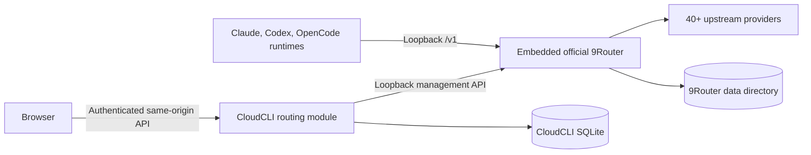

# Embedded 9Router Design

**Status:** Approved direction
**Date:** 2026-08-05
**Scope:** CloudCLI WebUI/Docker and the official `9router` runtime

## Summary

CloudCLI will bundle and supervise the official `9router@0.5.45` standalone server as an installation-scoped internal routing layer. It will not reimplement 9Router's provider adapters, OAuth flows, protocol translation, token refresh, quota tracking, account rotation, fallback selection, or data plane.

Users will no longer connect CloudCLI to 9Router. The Settings page will open directly into provider, route, model-source, and usage management. The 9Router endpoint, dashboard password, data-plane API key, JWT secret, machine salt, storage location, and process lifecycle are internal implementation details generated and managed by CloudCLI.

The official package is MIT licensed and contains a production Next.js standalone server at `app/custom-server.js`. CloudCLI will invoke that server directly rather than the interactive `9router` CLI, avoiding its browser, tray, update, port-killing, and terminal-menu behavior.

## Goals

- Ship the complete official 9Router routing layer in the CloudCLI installation and Docker image.
- Preserve 9Router's provider breadth, API-key connections, OAuth/device-code connections, custom providers, combos, quota tracking, fallback, protocol conversion, and `/v1` data plane.
- Remove all user-facing connection setup and deployment secret requirements.
- Keep all browser management calls authenticated and same-origin through CloudCLI.
- Keep native Claude, Codex, OpenCode, and Cursor identities and credentials unchanged.
- Start, health-check, restart, and stop the child runtime with CloudCLI.
- Fail safely to native provider behavior when the embedded router is unavailable.

## Non-goals

- Forking or copying 9Router's routing engine into CloudCLI.
- Exposing the standalone 9Router dashboard or listener to the network.
- Automatically migrating accounts from an unrelated external 9Router installation.
- Replacing coding-agent native login or credential files.
- Bypassing provider OAuth redirect restrictions in remote deployments.
- Automatically updating 9Router independently of a CloudCLI release.

## Product experience

`Settings > 9Router` becomes an always-available built-in feature.

The following controls are removed:

- Endpoint/base URL.
- Admin password.
- Data-plane API key.
- Connect, edit connection, test connection, and disconnect actions.
- `ROUTING_SECRET_KEY` and related secure-storage error messages.
- Environment-driven auto-connect.

The page contains:

1. **Built-in router status**: starting, ready, degraded, or unavailable; bundled version; retry action.
2. **Provider accounts**: provider catalog, API-key connection, OAuth authorization-code flow, device-code flow, enable/disable, priority, model catalog, test, edit, and delete.
3. **Routes**: 9Router combos and ordered fallback models.
4. **Agent defaults**: Native or 9Router route for each supported coding-agent runtime.
5. **Usage**: existing request, token, cost, and advisory-alert views.

The UI remains native CloudCLI React. The upstream 9Router dashboard is not framed or reverse-proxied because its root-relative Next.js assets and `/api` paths conflict with CloudCLI's routes, and a separately exposed dashboard would recreate the split configuration experience.

## Architecture

### Bundled runtime

- Add an exact `9router` package version, initially `0.5.45`, to production dependencies.
- Resolve the installed package location at runtime and start `app/custom-server.js` with `process.execPath`.
- Do not execute `cli.js`; it contains interactive menus, tray startup, update checks, broad process discovery, and port-killing behavior unsuitable for an owned child process.
- Bind only to `127.0.0.1`.
- Use port `20128` when available because upstream OAuth flows commonly assume it. The supervisor owns port probing and reports a typed unavailable state rather than killing an unrelated process.
- Set `DATA_DIR` to `<directory containing auth.db>/9router`, so a custom `DATABASE_PATH` or Docker volume persists both systems together.
- Pin upgrades to CloudCLI releases. Capability profiles and adapter tests advance with the pinned version.

### Runtime supervisor

A routing-owned service will:

1. Resolve and validate the packaged server entry point.
2. Build a minimal child environment.
3. Spawn one installation-scoped child process.
4. Poll `GET /api/health` with a bounded startup timeout.
5. Expose `starting`, `ready`, `degraded`, and `unavailable` state to the routing service.
6. Capture bounded, redacted stderr for diagnostics.
7. Restart unexpected exits with capped exponential backoff and a circuit breaker.
8. Send `SIGTERM`, wait, then use `SIGKILL` only after a shutdown deadline.
9. Stop before CloudCLI closes its database and exits.

CloudCLI itself continues to start when 9Router fails. Native agent operation remains available.

### Internal bootstrap

CloudCLI generates installation-scoped random values for:

- `JWT_SECRET`.
- `INITIAL_PASSWORD`.
- `API_KEY_SECRET`.
- `MACHINE_ID_SALT`.
- The internal data-plane API key when API-key enforcement is enabled.

These values are created once through the application configuration repository and are never returned to the browser or logged. They are not deployment configuration. The persistent directory and database retain restrictive filesystem permissions where the platform supports them.

The current `routing_connections` secret envelope is not used for the embedded runtime. CloudCLI builds the internal `NineRouterClient` from supervisor-owned loopback credentials. Therefore unavailable `ROUTING_SECRET_KEY` storage can no longer block provider or route management.

Encryption without an externally held secret cannot protect against an attacker who can read the complete persistent volume. The zero-configuration threat model protects credentials from browser exposure, API responses, logs, accidental database queries, and network access; host/volume compromise remains outside that boundary.

### Management adapter

The browser never receives the loopback origin or internal credentials. CloudCLI exposes explicit, allowlisted workflows rather than a generic proxy.

The adapter will cover the official management contracts used by the bundled version:

- Providers: list, get, create API-key account, update, delete, test, and models.
- OAuth: authorize, exchange, device-code, and poll.
- API keys: create an internal data-plane key and rotate it when required.
- Combos/routes: list, get, create, update, and delete.
- Models and usage.
- Custom provider nodes: list, create, validate, update, and delete.

All identifiers are encoded exactly once, request bodies are schema-validated, response sizes and timeouts are bounded, and upstream errors are converted to safe typed errors.

Settings, tunnel, CLI-tool mutation, password reset, dashboard exposure, and arbitrary upstream paths are not made user-callable.

### OAuth and connection methods

- Prefer device-code flows because they work in local and remote Docker deployments without inbound callback routing.
- For authorization-code providers that accept a caller-supplied redirect URI, use an authenticated CloudCLI callback workflow and store PKCE verifier/state server-side with a short TTL and one-time consumption.
- Validate OAuth state before exchange. Do not send verifier, refresh tokens, or provider credentials to the browser.
- Providers with a fixed localhost callback, including flows that require port `1455`, may use a short-lived loopback callback listener only when CloudCLI and the browser are on the same machine.
- In remote Docker deployments, a provider that offers neither device-code nor a configurable callback will show a precise unsupported-topology message. CloudCLI will not weaken callback validation or expose 9Router publicly to make such a flow work.

### Agent data path

Provider defaults and sticky per-session route IDs remain in CloudCLI SQLite. When a session is created, the routing runtime resolves the embedded loopback `/v1` origin and internal data-plane key, then injects them only into that agent run.

The actual prompt/model stream travels directly from the coding-agent runtime to the embedded 9Router child. It does not pass through Express or the browser.

If the child is unavailable:

- New sessions whose source is Native remain unaffected.
- New sessions explicitly bound to 9Router receive a clear router-unavailable error; CloudCLI must not silently send them to a different paid provider.
- A stored route ID absent from the embedded instance is shown as missing and cannot start a routed run until remapped.

## Installation scope and users

One embedded 9Router instance belongs to one CloudCLI installation. It is not spawned once per user because each Next.js runtime is comparatively heavy and OAuth callback ports are installation-scoped.

CloudCLI's authenticated users therefore operate the same account pool and routes, matching a shared gateway deployment. Secret values remain write-only. If role-based administration is added later, provider and route mutations can be restricted without changing the embedded process model.

## Migration

On upgrade:

1. Start the embedded runtime and make it the only default 9Router target.
2. Preserve existing native agent credentials and native provider defaults unchanged.
3. Stop reading external base URL/admin/data-plane credentials for normal operation.
4. Retain old `routing_connections` rows for one release as dormant rollback data; never return their ciphertext or credentials.
5. Mark external route IDs unresolved until the user recreates or imports the route into the embedded router.
6. Remove environment auto-connect and its documentation.
7. After the compatibility window, add a separate reviewed migration to remove obsolete connection fields and encrypted envelopes.

No provider account is copied automatically from an external 9Router because CloudCLI has no safe generic export contract for that instance.

## Error handling and observability

- Distinguish package missing, port occupied, startup timeout, child crash loop, incompatible version, OAuth topology unsupported, management request failure, and data-plane failure.
- Redact authorization headers, cookies, passwords, API keys, OAuth codes, tokens, PKCE verifiers, and child environment values.
- Keep only bounded child log tails and stable error codes.
- Surface a retry action in Settings without requiring a server restart.
- Disable usage polling while the router is not ready.

## Testing

### Unit tests

- Runtime environment generation never leaks secrets.
- Entry-point resolution and data-directory resolution.
- Readiness polling, timeout, restart backoff, circuit breaker, and graceful shutdown.
- Embedded client construction bypasses the external secret store.
- OAuth state/PKCE lifecycle and one-time exchange.
- Safe DTO parsing and redaction for every new management operation.

### Integration tests

- Fake child server starts, becomes ready, crashes, restarts, and shuts down.
- Database path relocation also relocates 9Router data.
- Settings APIs work without any routing environment variables.
- Provider, OAuth device-code, custom provider, route, model, and usage workflows remain same-origin and authenticated.
- A routed agent receives only the embedded origin/key for that run; native runs remain unchanged.

### UI tests

- First visit contains no connection form or secure-storage warning.
- Starting, ready, degraded, and unavailable states render correctly.
- API-key and OAuth/device-code provider flows remain on the Settings page.
- Provider secrets are cleared after successful writes and never rendered from responses.
- Missing routes and unsupported remote OAuth topology have actionable messages.

### Release validation

- Install from a clean npm checkout and build the Docker image.
- Launch with zero routing environment variables.
- Connect at least one API-key provider and one device-code/OAuth provider.
- Create a fallback combo and run Claude, Codex, and OpenCode through it.
- Restart the container and confirm accounts, routes, internal keys, and usage persist.
- Confirm the 9Router listener is unreachable from outside the container/host.

## Delivery slices

1. Bundle and supervise the pinned runtime; expose health state.
2. Bootstrap internal secrets and replace external connection resolution.
3. Remove connection UI/configuration and make current account/route/usage workflows zero-config.
4. Add the provider catalog and complete API-key/device-code/OAuth management adapters.
5. Add custom provider nodes and remaining supported connection methods.
6. Validate agent data-plane routing, persistence, Docker, lifecycle, and security end to end.
