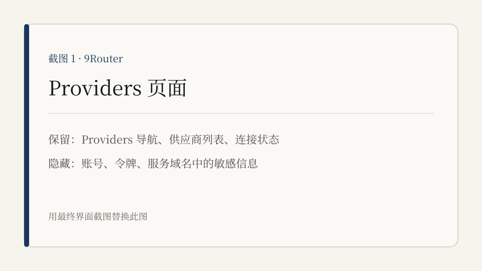
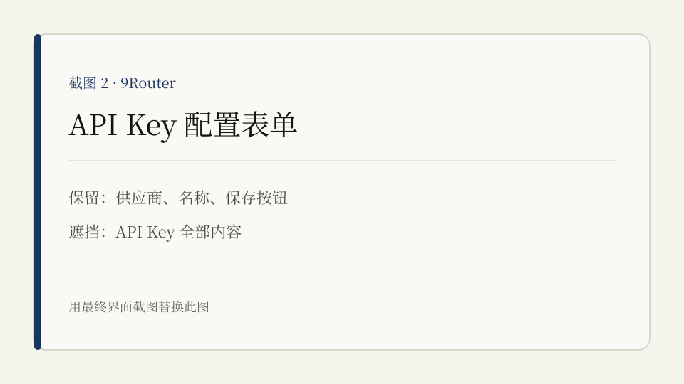
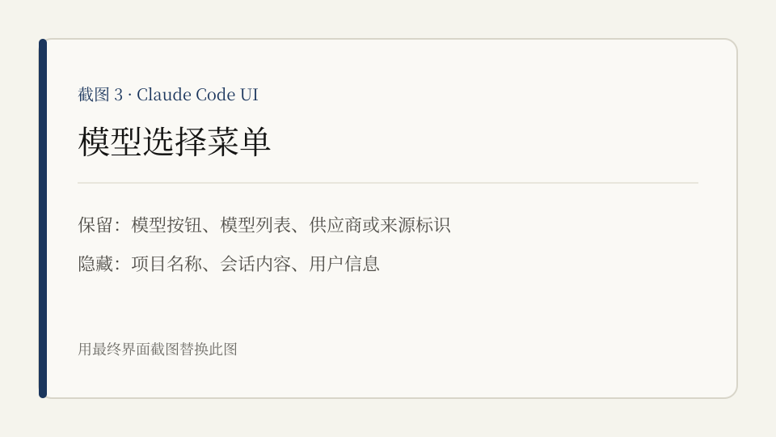
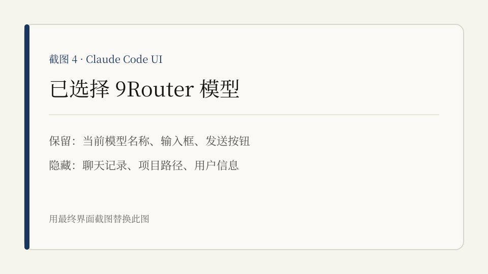

# 在 9Router 配置供应商，并在 Claude Code UI 选择模型

9Router 保存供应商账号和密钥，并通过 `/v1/models` 提供模型列表。Claude Code UI 读取该列表，在聊天页面显示可选模型。

两个服务拥有独立的访问地址。Claude Code UI 的原生 OAuth 登录不负责配置 9Router 供应商。

## 准备

- 9Router 服务地址和登录账号
- Claude Code UI 服务地址
- 模型供应商提供的 API Key

## 一、在 9Router 配置供应商

### 1. 打开 Providers 页面

访问 9Router，登录后进入 `Providers`。

### 2. 添加 API Key

选择供应商，填写账号名称和 API Key，保存配置。

API Key 由供应商控制台生成。不要把密钥填入 Claude Code UI，也不要在截图中显示密钥。

使用 OAuth 或设备码的供应商，请按 9Router 页面提示完成授权。自定义供应商还需填写服务地址和模型信息。

### 3. 检查模型

确认供应商状态正常，并能在 9Router 中看到对应模型。9Router 会通过 `/v1/models` 暴露这些模型。

## 二、在 Claude Code UI 选择模型

### 1. 打开模型菜单

访问 Claude Code UI，打开项目和会话。在输入框附近点击当前模型名称。

### 2. 选择 9Router 模型

在列表中找到 9Router 提供的模型。根据供应商名称和模型名称确认目标模型，点击选中。

### 3. 发送测试消息

发送一条短消息。收到正常回复后，配置完成。

## 模型没有出现

- 回到 9Router，检查供应商连接状态和模型列表。
- 刷新 Claude Code UI，重新打开模型菜单。
- 确认 Claude Code UI 能访问 9Router 的 `/v1/models`。
- 模型已停用或下线时，改选其他模型。

## 相关项目

- [Claude Code UI](https://github.com/siteboon/claudecodeui)
- [9Router](https://github.com/decolua/9router)
